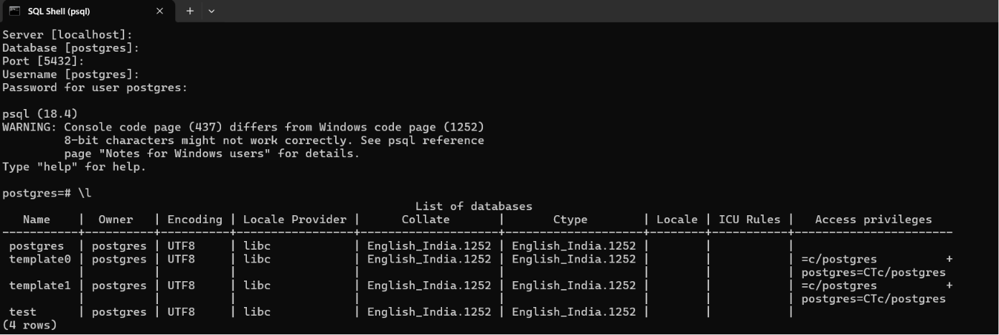
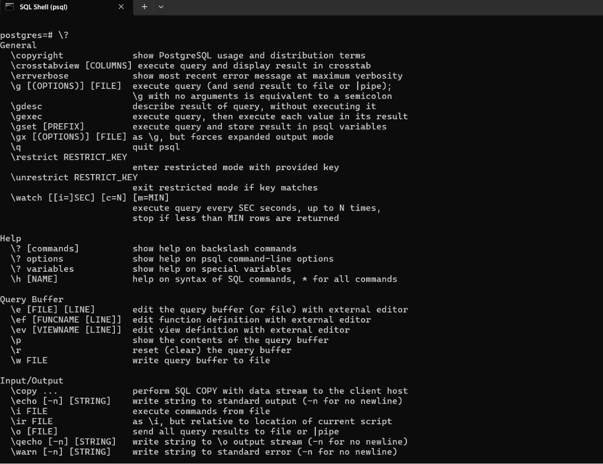
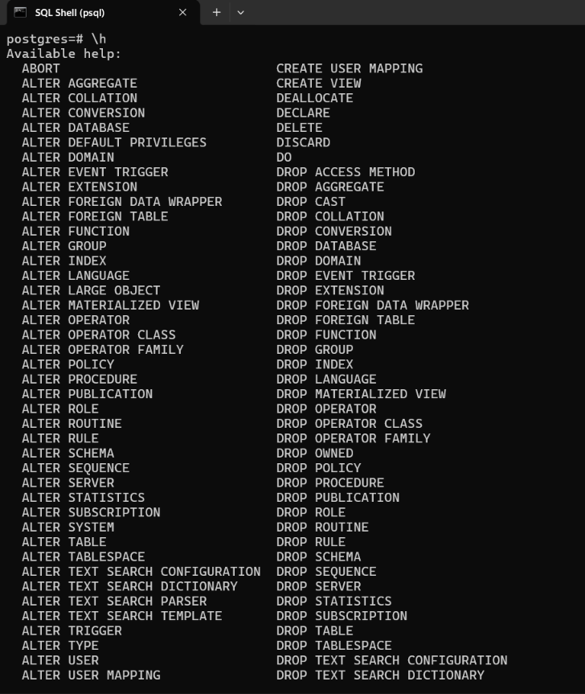

# 📊 Data Analytics Journey - Day 01

## 🚀 Topic: SQL + PostgreSQL Setup

Today I started my Data Analytics journey by setting up my SQL environment and learning PostgreSQL basics.

## 🛠 Tools Installed

- PostgreSQL
- pgAdmin 4
- SQL Shell (psql)
- VS Code

## 🎯 What I Learned Today

### PostgreSQL SQL Shell Commands

| Command | Purpose |
|---|---|
| \? | Shows all PostgreSQL commands |
| \h | SQL command help |
| \l | List all databases |
| \c database_name | Connect to database |
| \dt | Show tables |
| \d table_name | Describe table |
| \q | Exit SQL Shell |
| \! cls | Clear terminal screen |
| \conninfo | Show connection details |

---
## 📸 SQL Shell Practice





## 🗄 Database Basics

Created my first database:

```sql
CREATE DATABASE test; --to create database test 

CREATE DATABASE temp; --to create database temp


