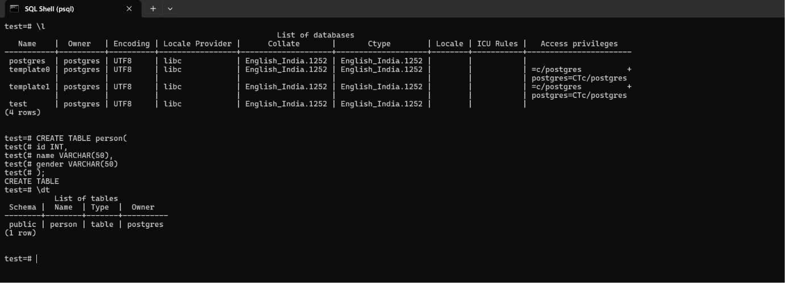
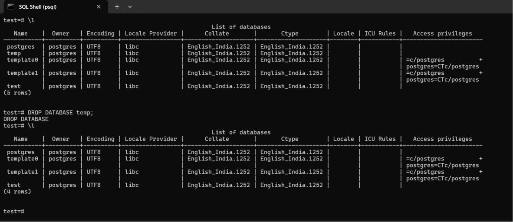

# 📅 Day 02 – Creating Databases & Tables in PostgreSQL

## 🎯 Goal

Today I learned how to create and manage databases and tables using PostgreSQL SQL Shell (psql).

---

## 📚 Topics Covered

- Creating databases
- Listing available databases
- Deleting databases
- Creating tables
- Viewing tables inside a database
- Understanding SQL syntax and multi-line queries

---

## 🛠 Commands Practiced

    

### Create a Database

```sql
CREATE DATABASE temp;


Today's Reflection

Today I understood the difference between a database and a table. I also learned that PostgreSQL allows writing SQL queries across multiple lines, which improves readability. This knowledge forms the foundation for storing and querying structured data.